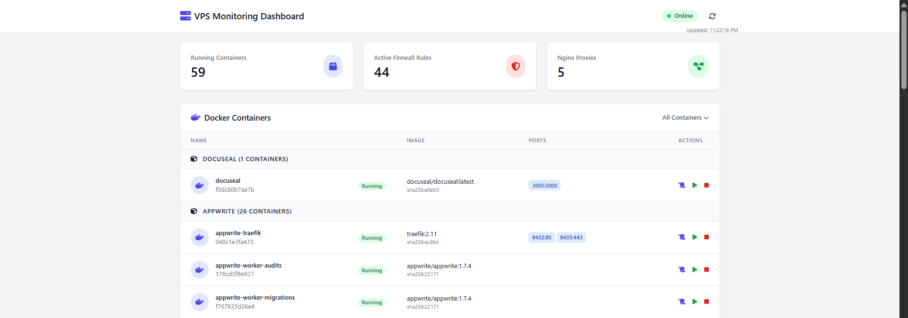
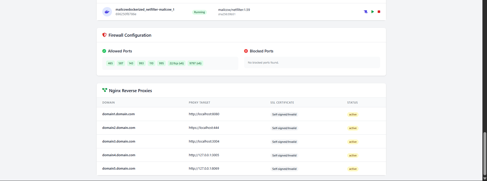

# VPS Monitoring Dashboard

A simple, self-hosted, at-a-glance dashboard to monitor the status of key services on your VPS. It consists of a lightweight Python (Flask) backend agent that runs on the server and a clean HTML/JS/Tailwind CSS frontend that displays the data.

 <!-- Replace with a URL to a screenshot of your dashboard -->

---

## Features

- **Docker Container Monitoring**: View all containers, grouped by solution (e.g., `appwrite`, `mailcow`, `standalone`). See their status, image, and exposed ports.
- **Firewall Status**: See a list of all `ALLOW` and `DENY` rules from UFW (Uncomplicated Firewall).
- **Nginx Reverse Proxies**: Lists all configured reverse proxies from your Nginx `sites-enabled` directory.
- **SSL Certificate Status**: For each Nginx proxy, it checks the associated SSL certificate and displays its validity and days until expiry.
- **Secure Access**: The dashboard is protected by a password prompt, with the secret managed via a `.env` file on the server.
- **Auto-Refresh**: A simple refresh button to fetch the latest data from the agent.

---

## Prerequisites

Before you begin, ensure you have the following installed on your VPS:

-   **Python 3** and `pip`
-   **Docker**
-   **UFW** (Uncomplicated Firewall)
-   **Nginx**

---

## Setup and Installation

Follow these steps to get your monitoring dashboard up and running on your VPS.

### 1. Clone the Repository

First, clone this project into a directory of your choice.

```bash
git clone <your-repo-url>
cd <your-repo-name>
```

### 2. Backend Setup

The backend consists of the Python agent that collects and serves the data.

#### a. Create a Virtual Environment

Navigate into the `backend` directory and create a Python virtual environment.

```bash
cd backend
python3 -m venv venv
source venv/bin/activate
```

#### b. Install Dependencies

Install the required Python libraries using the `requirements.txt` file.

```bash
pip install -r requirements.txt
```

#### c. Configure the Agent

Create a `.env` file in the `backend` directory. This file will hold your secret password.

```bash
# Make sure you are in the 'backend' directory
nano .env
```

Add the following line to the file, replacing the placeholder with a strong, unique password:

```
SECRET_PASSWORD=your-super-secret-password
```

Save and exit the file.

### 3. Create and Enable the `systemd` Service

To ensure the agent runs continuously in the background and starts on reboot, we will set it up as a `systemd` service.

#### a. Create the Service File

Create a new service file using a text editor like `nano`.

```bash
sudo nano /etc/systemd/system/vps-agent.service
```

#### b. Add Service Configuration

Paste the following configuration into the file. **You must replace the placeholder paths** with the absolute paths to your project directory.

```ini
[Unit]
Description=VPS Monitoring Agent
After=network.target

[Service]
# The WorkingDirectory should point to your 'backend' subfolder
WorkingDirectory=/home/your_username/path/to/project/backend

# The ExecStart path must also point to the python executable inside your venv
ExecStart=/home/your_username/path/to/project/backend/venv/bin/python /home/your_username/path/to/project/backend/agent.py
Restart=always

[Install]
WantedBy=multi-user.target
```

**Important:**
-   Replace `/home/your_username/path/to/project` with the actual path to where you cloned the repository.
-   The service will run as the `root` user by default, which is necessary for the agent to access Docker and UFW information without password prompts.

#### c. Start and Enable the Service

Reload the `systemd` daemon, then start and enable your new service.

```bash
sudo systemctl daemon-reload
sudo systemctl start vps-agent
sudo systemctl enable vps-agent
```

You can check the status to ensure it's running correctly:

```bash
sudo systemctl status vps-agent
```

### 4. Hosting with Nginx (Recommended)

Instead of opening the `index.html` file directly, it's much better to serve the frontend using Nginx. This setup also acts as a reverse proxy for the API, which is more secure and avoids potential CORS issues.

#### a. Create Nginx Configuration File

Create a new Nginx server block configuration file.

```bash
sudo nano /etc/nginx/sites-available/dashboard
```

Paste the following configuration into the file. Remember to replace the placeholders.

```nginx
server {
    listen 80;
    server_name your_vps_ip_or_domain.com; # Replace with your VPS IP or a domain name

    # Path to the frontend files
    root /home/your_username/path/to/project/frontend/live; # Replace with the correct path
    index index.html;

    location / {
        try_files $uri $uri/ =404;
    }

    # Reverse proxy for the API
    # All requests to /api/... will be forwarded to the Python agent
    location /api/ {
        proxy_pass [http://127.0.0.1:9999/api/](http://127.0.0.1:9999/api/);
        proxy_set_header Host $host;
        proxy_set_header X-Real-IP $remote_addr;
        proxy_set_header X-Forwarded-For $proxy_add_x_forwarded_for;
    }
}
```

#### b. Enable the Site

Create a symbolic link from your new configuration file to the `sites-enabled` directory.

```bash
sudo ln -s /etc/nginx/sites-available/dashboard /etc/nginx/sites-enabled/
```

#### c. Test and Restart Nginx

First, test your Nginx configuration for syntax errors.

```bash
sudo nginx -t
```

If the test is successful, restart Nginx to apply the changes.

```bash
sudo systemctl restart nginx
```

### 5. Frontend Configuration

Now that Nginx is handling the requests, we can simplify the API URL.

#### a. Edit `script.js`

Open the `frontend/live/script.js` file and update the `API_URL` variable to be a relative path. This works because Nginx will proxy any request starting with `/api/` to the backend agent.

```javascript
// --- Configuration ---
// The URL is now relative, as Nginx will handle proxying the request.
const API_URL = '/api/v1/stats';
```

### 6. Access Your Dashboard

You're all set! To view the dashboard, navigate to the `server_name` you configured in Nginx (e.g., `http://your_vps_ip_or_domain.com`) in your web browser. When prompted, enter the `SECRET_PASSWORD` you set in the `.env` file.

---

## Project Structure

```
.
├── backend/
│   ├── venv/
│   ├── .env                # Holds the secret password (not committed to git)
│   ├── agent.py            # The Python Flask agent
│   └── requirements.txt    # Backend dependencies
│
└── frontend/
    └── live/
        ├── index.html      # The main dashboard page
        ├── script.js       # Frontend logic and API calls
        └── styles.css      # Custom styles
```

---

## Security Note

The password protection is a basic authentication layer. For enhanced security, consider using a tool like `certbot` to add a free SSL certificate to your Nginx site. Ensure your VPS firewall is configured to only allow access to port `9999` from localhost, and expose only ports 80 (HTTP) and 443 (HTTPS) to the public.
